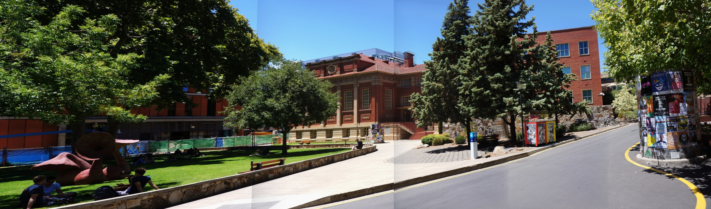

# PP2024-Image-Stiching-Acceleration



This is our final project for NTU 2024 Parallel Programming course, mainly focusing on accelerating SIFT algorithm with OpenMP and ROCm HIP.

## File Structure
```
├── README.md
└── SIFT-Optimizing/
    ├── CMakeLists.txt
    ├── FindKeypoints.sh
    ├── ImageStitching.sh
    ├── MatchFeatures.sh
    ├── bin/ -> executables and results
    ├── demo.jpg
    ├── examples/ -> parallel example usages
    ├── examples_seq/ -> sequential example usages
    ├── imgs/ -> image datasets
    ├── profile.py
    ├── src/ -> parallel source code for image stitching implementations
    └── src_seq/ -> sequential source code for image stitching implementations
```

## Environment
- **OpenCV**: `4.x` 

- **G++**: `>= 11.0`

- **HIPCC**: `ROCm 6.2.1`


## User Guide
In order to run our script for phase 1 (finding keypoints), phase2 (matchfeatures), or phase3 (image stiching), follow the below steps.

1. Choose whether to run sequential code or parallel code.
    Modify`./CMakeLists.txt` : 
    - To run parallel code : modify the last two rows to
        ```
        add_subdirectory(src)
        add_subdirectory(examples)
        ```
    - To run sequential code : modify the last two rows to 
        ```
        add_subdirectory(src_seq)
        add_subdirectory(examples_seq)

2. Choose which phase to run : 
    - `./FindKeypoints.sh` : finding keypoints for 4 input images.
        - Results directed to `./bin/find_keypoints_profile.txt`

    - `./MatchFeatures.sh` : match features for 4 pairs of images.
        - Results directed to `./bin/match_features_profile.txt`
        - Feature-matched image at `./bin/result.jpg`

    - `./ImageStiching.sh` : perform image stitching on 1 pair of images.
        - Results directed to `./bin/image_stitching_profile.txt`
        - Stitched image at `./bin/overlaid_result.jpg`

